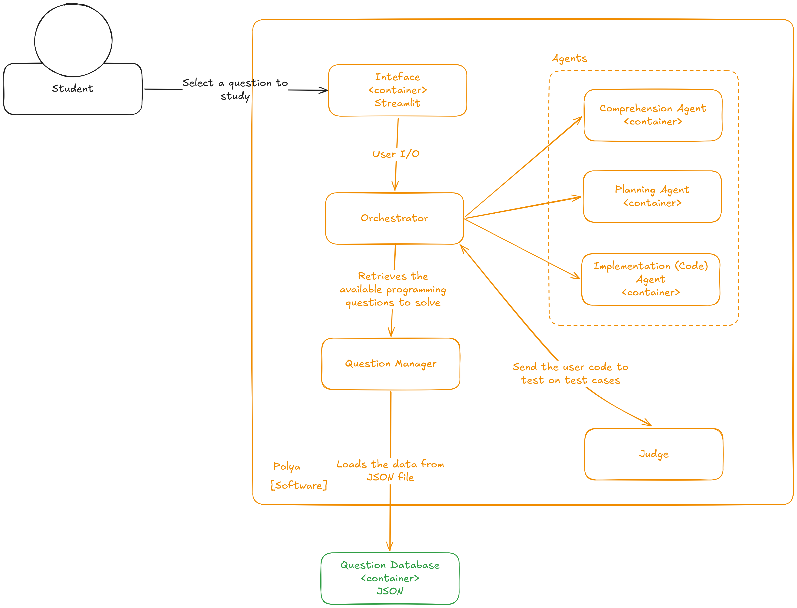
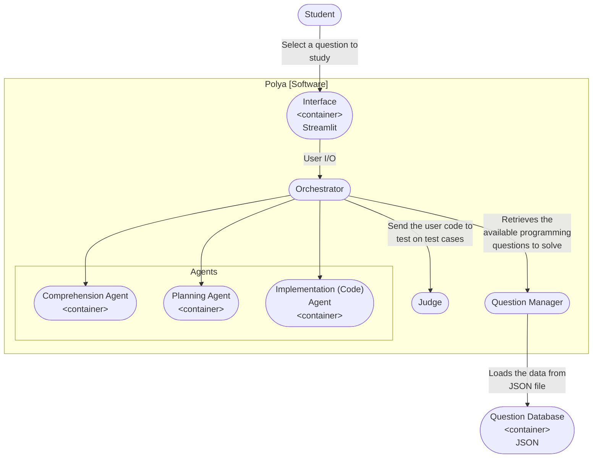
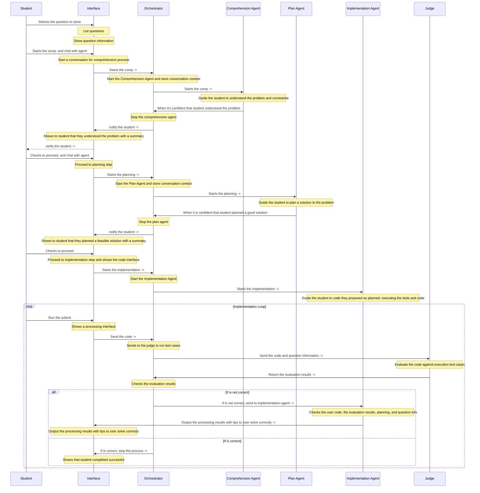

# Pólya - Project Overview

Pólya is a system that helps freshman programming students to solve programming problems. Based on the Pólya's four-step method for problem solving, Pólya focus on each step as a separate task, and provides immediate feedback to the student. 

## Pólya's four-step method

1. Understand the problem (Comprehension)
2. Devise a plan (Planning)
3. Carry out the plan (Implementation)
4. Look back (Testing)

## System Architecture

## System Main Flow

# Tech Stack

| Component | Technology |
|-----------|------------|
| Package Manager | uv |
| Interface | Streamlit |
| Orchestrator | Python |
| Question Manager | Python |
| Judge | Judge0 Python SDK |
| Comprehension Agent | Python, Haystack |
| Planning Agent | Python, Haystack |
| Implementation Agent | Python, Haystack |
| Question Database | JSON |