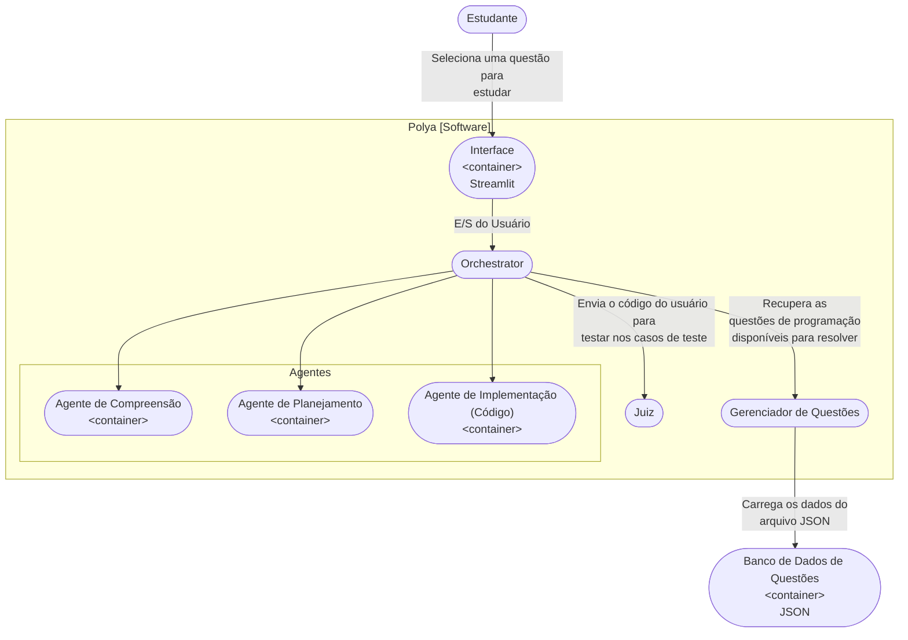
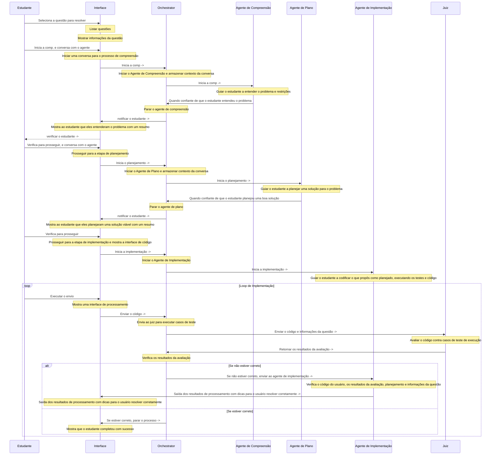

# Pólya - Visão Geral do Projeto

Pólya é um sistema que ajuda estudantes de programação iniciantes a resolver problemas de programação. Baseado no método de quatro etapas de Pólya para resolução de problemas, Pólya foca em cada etapa como uma tarefa separada e fornece feedback imediato ao estudante.

## Método de quatro etapas de Pólya

1. Entender o problema (Compreensão)
2. Elaborar um plano (Planejamento)
3. Executar o plano (Implementação)
4. Revisar (Teste)

## Arquitetura do Sistema

## Fluxo Principal do Sistema

# Pilha de Tecnologia

| Componente | Tecnologia |
|------------|------------|
| Gerenciador de Pacotes | uv |
| Interface | Streamlit |
| Orchestrator | Python |
| Gerenciador de Questões | Python |
| Juiz | Piston (Auto-hospedado via Docker) |
| Agente de Compreensão | Python, Haystack |
| Agente de Planejamento | Python, Haystack |
| Agente de Implementação | Python, Haystack |
| Banco de Dados de Questões | JSON |